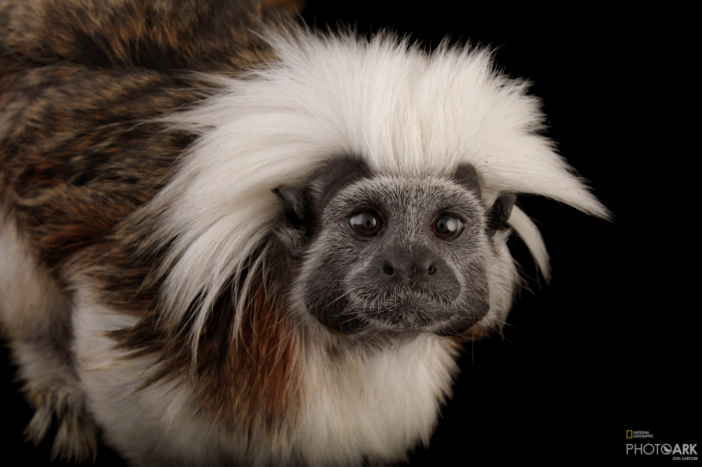

```{r setup, echo = FALSE}
## R setup ##

chooseCRANmirror(graphics = FALSE, ind = 1)
knitr::opts_chunk$set(warning = FALSE, message = FALSE, echo = TRUE, eval = TRUE)

## Load packages ##

# Package list
pkg_list <- c("plyr","tidyverse", "data.table", "ggplot2", "kableExtra", "vembedr")

# Load packages
pacman::p_load(pkg_list, character.only = TRUE)
```

# Second Order Motor Planning 

<!-- Custom CSS formatting to left-align text and remove image borders -->
<style type="text/css">
  .reveal p {
    text-align: left;
  }
  .reveal ul {
    display: block;
  }
  .reveal ol {
    display: block;
  }
  .reveal section img { 
    background:none; 
    border:none; 
    box-shadow:none; 
  }
</style>

- Changing how you manipulate objects, not only on the immediate demands (picking it up) but also on the goal of the object use
- Planning for future actions with the object
- When grabbing a spoon to eat, the action end, or the bucket needs to be directed towards your mouth

# Spoon Task

- Thumb oriented towards the action end = Efficient Radial Grasp
- Thumb oriented away from the action end = Inefficient Ulnar Grasp

<center>{width=500px}</center>

# Spoon task
- Depending on where the action end is you may need to inhibit your dominant hand to keep your thumb pointing towards the action end
- This behaviors emerges as young as 9m.o.

<center>{width=500px}</center>

# Inefficient Ulnar Grasp
<center></center>

# Efficient Radial Grasp
<center></center>


# Cup Task

- Classic example of 2nd Order Motor Planning is flipping a cup to fill with water
- Using an initially uncomfortable inverted grasp makes turning over the cup completable in one smooth motion
- Using a typical grasp requires additional adjustment to turn the cup over


<left></left>               <right></right>

# Cup Task
- Lengthy developmental trajectory into late adolescence 
- Requires using an initially uncomfortable posture
- Inhibiting typical / comfortable posture may be more difficult than inhibiting dominant hand 

<center></center>

# Physical Constraints

- The more degrees of freedom a species’ dexterity allows, and the ability to make precision grips, is associated with inconsistent 2nd order motor planning
- Morphological constraints drive efficiency

<center>{width=600px}</center>

# Cup Task Dex

- Low Dexterity primates are more efficient than High Dex. primates in Cup Task
- Capuchins & Chimps are inefficient while Tamarins are efficient 

<center>{width=600px}</center>

# Spoon / Dowel Task Dex

- Dexterity seems less important in Spoon / Dowel Task
- Capuchins are efficient here, unlike cup task
- The demands of either inhibiting a dominant hand in the spoon task and inhibiting a typical grasping posture in the cup task are leading to different planning

<center>{width=600px}</center>

# Tamarins

- Spoon / Dowel task has lower constraints than cup task
- Tamarins have low dexterity & no tool use
- In Cup Task, tamarins perform better than other dexterous species
- When cost of error is lower, will tamarins continue to use efficient grips?
<center>{width=500px}</center>


# Methods

- *N* = 7
  - 265 trials
  - 87 Left Baited
  - 87 Control Trials
  - 91 Right Baited
  

<left></left> 


# Efficient Radial Grasp

<center></center>


# Inefficient Ulnar Grasp

<center></center>

# Results
- 6/7 tamarins used a radial grasp more often than chance
- As a sample, the tamarins showed a preference for efficient radial grasps
  - *ß* = 8.71, *t*(34) = 4.58, *p* = .001, 95%CI [4.85, 12.58]
- No learning effect
<center>{width=600px}</center>

# Summary
- Tamarins are the most morphologically constrained species that has been tested on either tasks
- Tamarins are only species so far that are efficient on cup & spoon task
- Low dexterity tamarins may use 2nd order motor planning more often than high dexterity species due to higher cost of mistakes
- Need to test more species on both tasks to explore the Morphological Constraint Hypothesis

# Thanks! 
- Language & Cognition Lab
- Ricky Groner
- Mary Roe
- Holly Zaharchuk for the RMD workshop!  
<center>{width=500px}</center>

# Links

- [YouTube Video from Psychonomics](https://www.youtube.com/watch?v=XsWeMnKo1HE)
  
- [Twitter thread](https://twitter.com/natalie_schwob/status/1329553604949241856) 

- [Website](https://ngschwob.wixsite.com/natalieschwob)